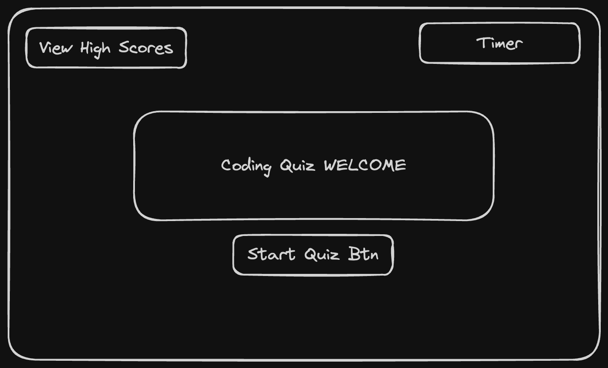
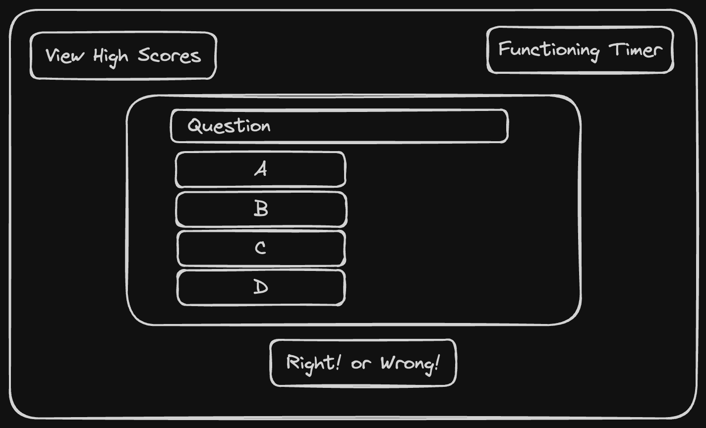
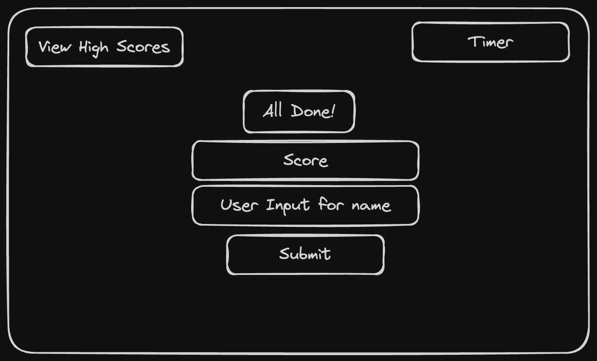
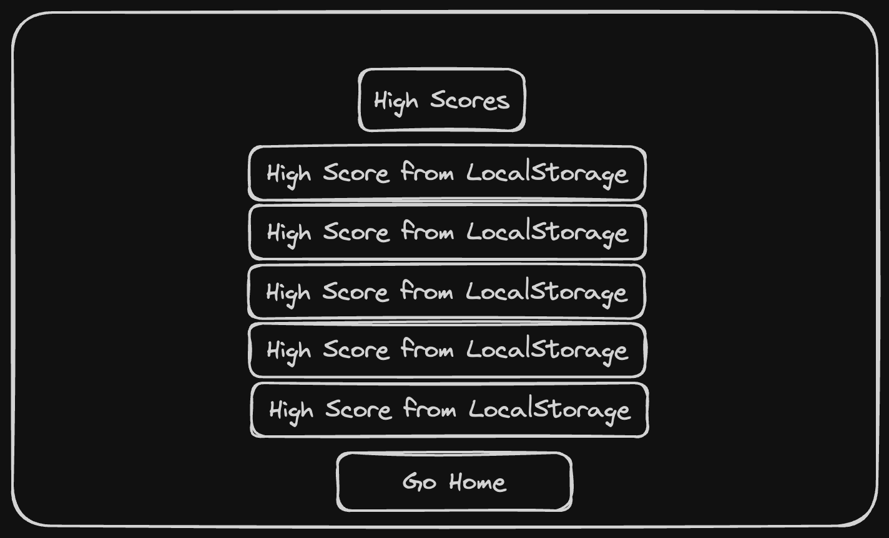

## Code Quiz

These are the directions given:
- AS A coding boot camp student I WANT to take a timed quiz on JavaScript fundamentals that stores high scoresSO THAT I can gauge my progress compared to my peers.

As a result, the coding quiz will have the following attributes:
- WHEN I click the start button THEN a timer starts and I am presented with a question
- WHEN I answer a question THEN I am presented with another question
- WHEN I answer a question incorrectly THEN time is subtracted from the clock
- WHEN all questions are answered or the timer reaches 0 THEN the game is over
- WHEN the game is over THEN I can save my initials and score

## Wireframing
- There are going to be four separate pages of this quiz. Each will have it's own HTML page. See below. 

   

## HTML